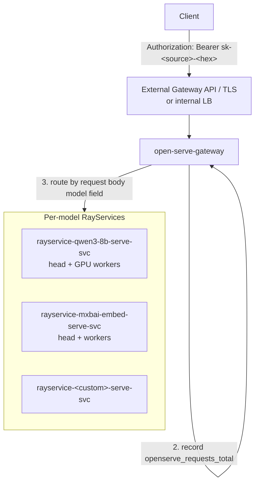

# Architecture

## The request path



A request arrives with a Bearer token. The gateway:

1. **Authenticates** — looks the token up in the key map (Secret `open-serve-api-keys`) and resolves it to a `source` name. No match → 401.
2. **Meters** — increments `openserve_requests_total{source, model, org, tier}`, where `model` comes from the request body's `model` field, `org` from a configurable header (`x-openserve-org-id` by default), and `tier` from the model→tier map the chart renders.
3. **Routes** — by the JSON request body's `model` field, for *every* endpoint: chat, completions, embeddings, `/tokenize`, `/detokenize`, `/v1/responses`, score/rerank, audio. The gateway looks the `model` value up in `gateway.modelRoutes` and forwards to that model's RayService Service. There is no path-prefix routing and no default backend:

    - Body has no `model` field → `400` (OpenAI-style error).
    - `model` value not in `modelRoutes` → `404` (OpenAI-style error).

    One special case: `GET /v1/models` carries no body, so it is not forwarded at all — the gateway fans out to *every* backend in `modelRoutes` and merges the results, since each per-model backend only lists its own models (see [API reference](../reference/api.md#get-v1models-aggregation)).

    The status page is the only no-auth forwarding path: `gateway.publicRoutes` maps a small set of path prefixes (auto-wired when `statusPage` is enabled) to the status Service, bypassing both auth and model routing.

4. **Forwards** — non-streaming responses are buffered so token usage can be extracted into `openserve_tokens_total`; `"stream": true` requests are proxied chunk-by-chunk as SSE.

## Why one RayService per model

Each enabled entry in `serveModels` renders its **own RayService** — its own Ray head, its own worker group, its own Kubernetes Service (`rayservice-<name>-serve-svc:8000`). Compared with packing many models into one Ray cluster:

- **Independent failure domains** — a model OOM-ing or crash-looping can't take down its neighbors; the blast radius of a bad rollout is one model.
- **Independent scaling** — each model gets its own Serve autoscaling bounds (`replicas.min/max`), worker-pod bounds (`replicas.workerMin/workerMax`), GPU shape, and node selector.
- **Independent rollouts** — changing one model's config rolls only that model's RayService.
- **Honest per-model observability** — pods carry `model` and `open-serve.io/tier` labels, so every metric, alert, and dashboard slices cleanly per model.

The cost is a Ray head pod per model — a deliberate trade of a small fixed overhead for isolation.

## Zero-downtime rollouts

RayService is KubeRay's zero-downtime primitive: when the cluster spec changes, KubeRay boots a **pending RayCluster** with the new spec, waits until its Serve applications are healthy, then flips the stable Service to the new cluster and tears down the old one. Traffic never routes to a cluster that hasn't finished loading model weights.

Two chart options harden this in practice (both default off; opt in via your values overlay):

- **`rayClusterChecksum.enabled`** — works around a kuberay-operator gap where `minReplicas`/`maxReplicas` changes don't propagate to the live RayCluster (the autoscaler stays silently capped at the original values). The chart stamps a `checksum/worker-config` annotation hashed from the full per-model values onto the pod templates, so *any* per-model change triggers the zero-downtime swap. Scope is per model — only the changed model rolls.
- **`workerReadinessProbe.enabled`** — replaces KubeRay's default readiness probe (which goes green when the Serve HTTP proxy starts, *before* weights are loaded) with one that polls the Ray dashboard and only reports Ready when this pod hosts a `RUNNING` replica. Ray's internal routing is already correct either way; this makes `kubectl`, endpoint health, and dashboards honest.

The status page's incident detector expects these swaps: it filters out single-probe blips (default: an incident requires ≥2 consecutive failed samples) precisely because a rolling swap can drop one probe sample without customer impact.

## Scale-to-zero

Serve replica autoscaling is per model:

```yaml
replicas: { min: 0, max: 1 }        # Serve replicas; min: 0 = scale-to-zero
autoscaling:
  targetOngoingRequests: 5
  downscaleDelayS: 600              # idle time before scaling down
  upscaleDelayS: 60
```

With `min: 0`, an idle model's Serve replicas — and, with worker bounds set accordingly, its GPU worker pods and eventually the GPU **node** — go away entirely. The first request after idling pays the cold-start price (node provision + image pull + weight load). Conventions that follow from this:

- `tier: production` models normally keep `min >= 1` so the synthetic probe (and users) hit warm replicas.
- `tier: internal-test` models default to scale-to-zero; alerts like `RayServeNoReplicas` are gated on `tier="production"` so zero replicas on a test model is not an alert condition.
- The gateway's `/v1/models` aggregation deliberately uses a short per-backend timeout and **drops** cold backends from the listing rather than waking them for a directory call.

## Components

| Component | Kind | Role |
|---|---|---|
| **gateway** (`services/gateway`) | Deployment (default 2 replicas + PDB) | Bearer-token auth against the key map, model-field routing via `modelRoutes`, `/v1/models` aggregation, `publicRoutes` forwarding for the status page, usage metrics (`openserve_requests_total`, `openserve_tokens_total`, `openserve_errors_total`, latency histogram) |
| **probe** (`services/probe`) | Deployment (1 replica, internal scheduler) | Synthetic end-to-end prober: internal liveness direct to each RayService + external functional request through the gateway, every 15 minutes, for `tier: production` models only |
| **status** (`services/status`) | Deployment (2 replicas) | Public status page reading `openserve_probe_*` from Prometheus; three-tier (healthy/degraded/down) classification, hourly uptime strips, incident history |
| **monitoring** (chart resources) | ConfigMaps, PodMonitors, PrometheusRules | Six Grafana dashboards, alert rules, and scrape configs that plug into an existing kube-prometheus-stack |
| **per-model RayServices** | RayService CRs | The models themselves — one Ray cluster each, serving an OpenAI-compatible app on port 8000 |

Deep dives: [Runners](runners.md) · [API keys](../operations/api-keys.md) · [Observability](../operations/observability.md).
