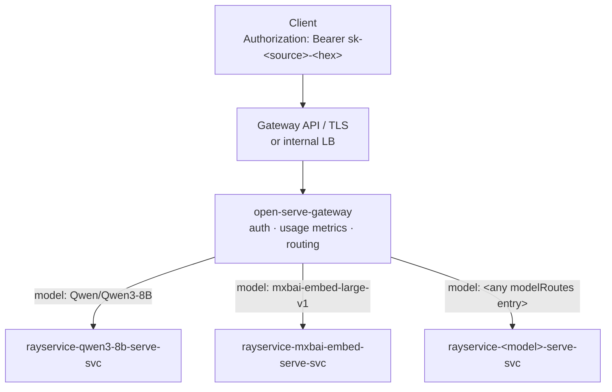

# open-serve

**An open, batteries-included model-serving framework for Kubernetes, built on Ray Serve, Ray Serve LLM, and vLLM.**

open-serve turns a Kubernetes cluster into a production model-serving platform. You enable models from a curated catalog (`enabled: true` in Helm values) and get an OpenAI-compatible endpoint backed by everything a production deployment actually needs:

- **Per-model Ray Serve deployments** — each model runs as its own KubeRay RayService with zero-downtime rollouts and scale-to-zero autoscaling
- **API-key authentication and routing** — a lightweight gateway validates Bearer tokens, routes to the right model backend, and records per-source/model/org usage metrics
- **Observability out of the box** — Grafana dashboards (Ray, Serve, vLLM, model comparison, SLO), Prometheus alert rules, and a synthetic end-to-end probe
- **A public status page** — per-model health in the style of status.openai.com, driven by probe metrics with latency-aware SLO classification
- **GitOps-native deployment** — a FluxCD reference layout with kustomize base + environment overlays
- **Cost tracking** — per-model GPU-hour and token attribution *(roadmap — see [Cost](operations/cost.md))*

GCP/GKE is the first supported provider; bring-your-own-cluster is a first-class path. AWS and Azure are on the roadmap.

!!! info "Current release: {{ release_version }}"
    See the [releases page](https://github.com/hari-kathi/open-serve/releases) for artifacts and upgrade notes. Pre-1.0, minor versions may include breaking changes — read the notes when upgrading.

## How a request flows



The gateway validates the Bearer token against a key map, records `openserve_requests_total{source, model, org, tier}`, and routes **every** request — chat, embeddings, `/tokenize`, `/detokenize`, `/v1/responses` — by the request body's `model` field. Each model is an **independent RayService**: models scale, roll out, and fail in isolation. See [Architecture](concepts/architecture.md) for the full picture.

## Pick a runner

Every model entry declares a `type:` that selects one of three runners:

| `type:` | Use when | API surface |
|---|---|---|
| `vllm` *(default)* | Any OpenAI-compatible model — chat, completions, embeddings, multimodal | Everything vLLM serves: chat, completions, embeddings, `/v1/responses`, `/tokenize`, `/detokenize`, `/v1/score`, `/v1/rerank`, audio |
| `ray-serve-llm` | You want Ray Serve LLM's `LLMConfig` + `build_openai_app` flow | `/v1/chat/completions`, `/v1/completions`, `/v1/embeddings`, `/v1/models` |
| `custom` | Non-LLM models (rerankers, OCR, CNNs) | Your own serve script / import path |

Every `vllm` model serves `/tokenize` and `/detokenize` natively — routed by `model` like everything else; `ray-serve-llm` models don't serve them. Details in [Runners](concepts/runners.md).

## Where to go next

- **Try it locally** — [Local demo on kind](quickstart/kind.md): CPU-only, no GPUs, exercises the full gateway → model → probe → status path.
- **Deploy for real** — [End-to-end on GCP](quickstart/gcp.md): reference Terraform + the FluxCD GitOps layout.
- **Serve a new model** — [Adding a model](operations/adding-a-model.md): the runbook from catalog preset to validated endpoint.
- **Understand the system** — [Architecture](concepts/architecture.md), [Runners](concepts/runners.md), [Model catalog](concepts/model-catalog.md).
- **Run it in production** — [API keys](operations/api-keys.md), [Observability](operations/observability.md), [Cost](operations/cost.md).
- **Call the API** — [API reference](reference/api.md).

## Repository layout

```
charts/open-serve/     # the serving Helm chart
services/
  gateway/             # auth + routing + usage metrics
  probe/               # synthetic end-to-end prober
  status/              # public status page
runtimes/
  vllm/                # vllm runtime (ASGI passthrough to vLLM's OpenAI app)
  ray-serve-llm/       # ray-serve-llm runtime image
catalog/models/        # curated model presets
deploy/flux/           # GitOps reference (FluxCD + kustomize)
terraform/gcp/         # optional reference infrastructure (GKE + GPU pools)
examples/              # quickstarts (kind, GCP)
scripts/               # operational tooling (connect, smoke tests, load tests)
```

## Contributing

Adding a preset for a newly released open-weights model is the easiest way to contribute — presets live in `catalog/models/`. See `CONTRIBUTING.md` in the repository root.

open-serve is licensed under [AGPL-3.0](https://github.com/hari-kathi/open-serve/blob/main/LICENSE).
